# DESPLIEGUE NGINX — Evidencias y respuestas

Este documento recopila todas las evidencias y respuestas de la practica.

---

## Parte 1 — Evidencias minimas

### Fase 1: Instalacion y configuracion

1) Servicio Nginx activo
- Que demuestra: El servicio Nginx esta instalado y funcionando correctamente
- Antes de usar Docker, probe Nginx instalado directamente en el sistema con: `systemctl status nginx`
- Una vez montado en Docker, verifico que el contenedor esta corriendo con: `docker compose ps`
- Evidencia: 
  - 
  - 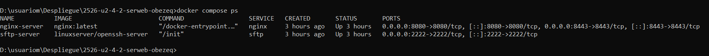


2) Configuracion cargada
- Que demuestra: El archivo de configuracion del sitio esta creado y cargado por Nginx
- Primero, cuando probe Nginx instalado en el sistema, tuve que crear un symlink para activar el sitio: `sudo ln -s /etc/nginx/sites-available/webpracticadespliegue41.light /etc/nginx/sites-enabled/`
- Despues, cuando pase a Docker, la configuracion se monta directamente como volumen en conf.d. Para comprobarlo ejecute: `docker compose -f docker-compose.windows.yml exec nginx ls -l /etc/nginx/conf.d/`
- Evidencias:
  - 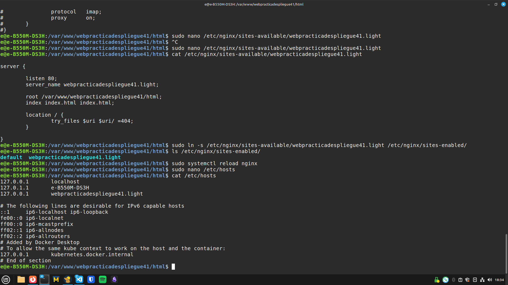
  - 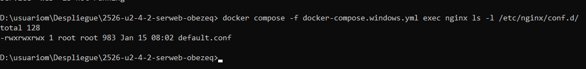

3) Resolucion de nombres
- Que demuestra: Se puede acceder al sitio usando el nombre de dominio configurado en /etc/hosts
- Evidencia: 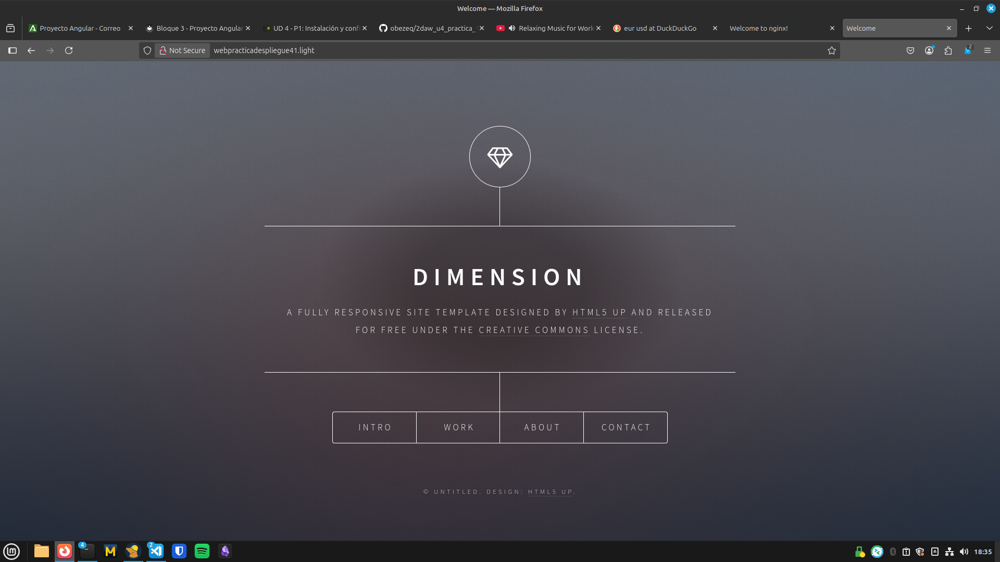

4) Contenido Web
- Que demuestra: La web de Cloud Academy se muestra correctamente
- Evidencia: 

### Fase 2: Transferencia SFTP (Filezilla)

5) Conexion SFTP exitosa
- Que demuestra: Filezilla conecta correctamente al servidor SFTP en el puerto 2222
- Evidencia: 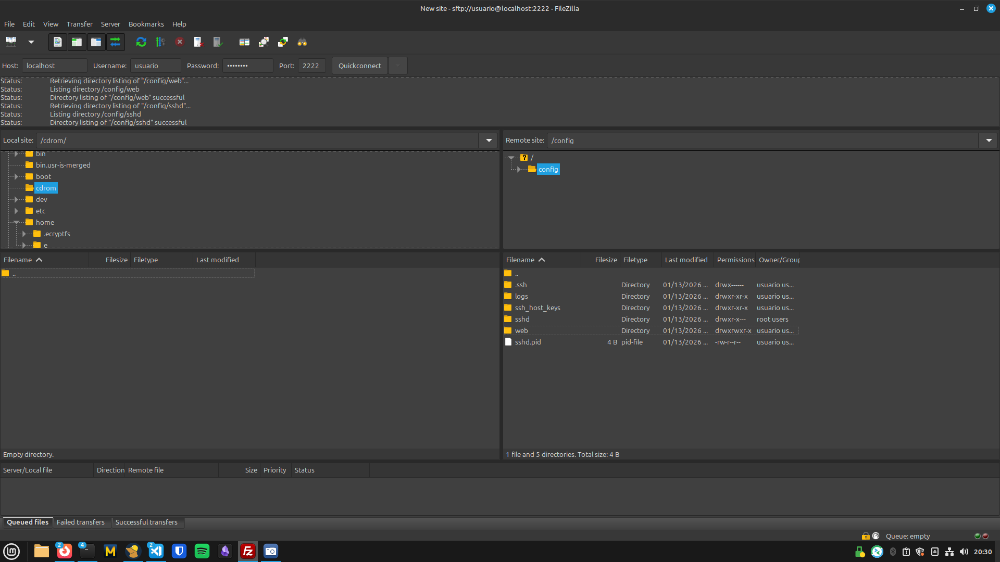

6) Permisos de escritura
- Que demuestra: Se pueden subir archivos al servidor mediante SFTP
- Evidencia: 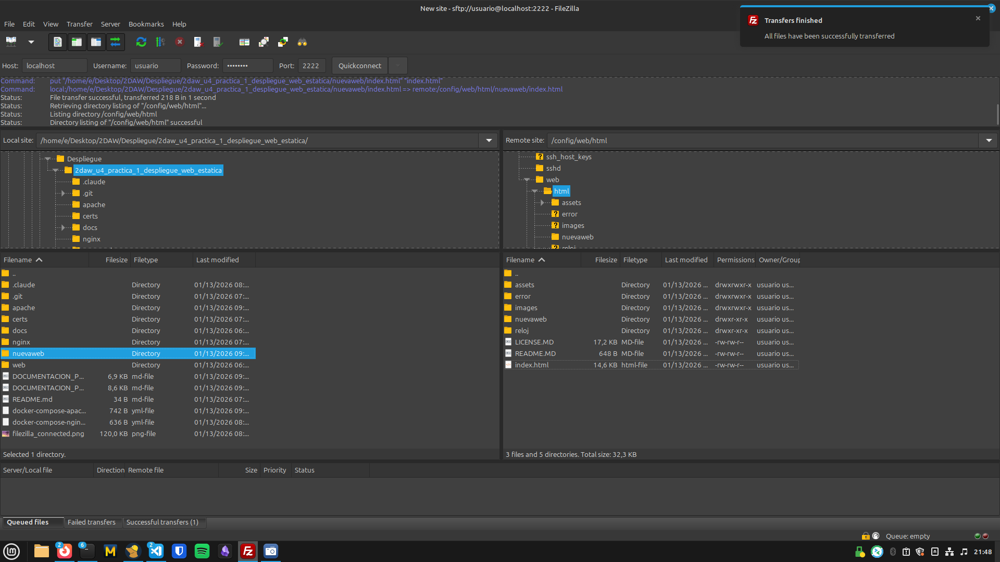

### Fase 3: Infraestructura Docker

7) Contenedores activos
- Que demuestra: Los contenedores de Nginx y SFTP estan ejecutandose
- Comando: `docker compose ps`
- Evidencia: 
  - 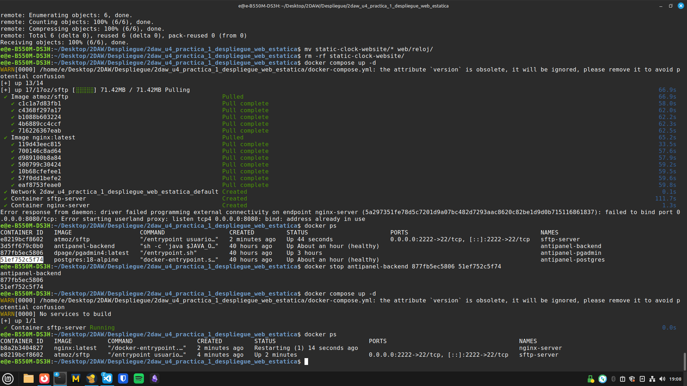
  - 

8) Persistencia (Volumen compartido)
- Que demuestra: Los archivos subidos por SFTP aparecen automaticamente en la web
- Evidencia: 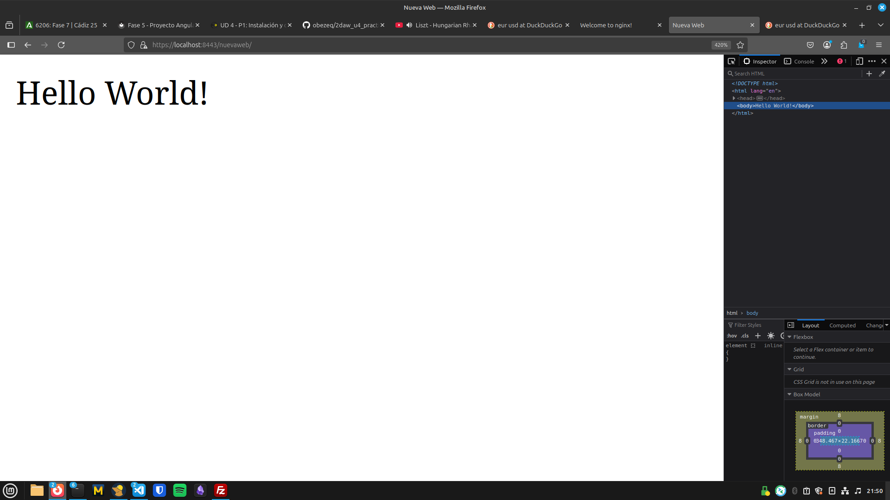

9) Despliegue multi-sitio
- Que demuestra: El reloj funciona en la ruta /reloj
- Evidencia: 

### Fase 4: Seguridad HTTPS

10) Cifrado SSL
- Que demuestra: La web se sirve por HTTPS con certificado autofirmado
- Evidencia: 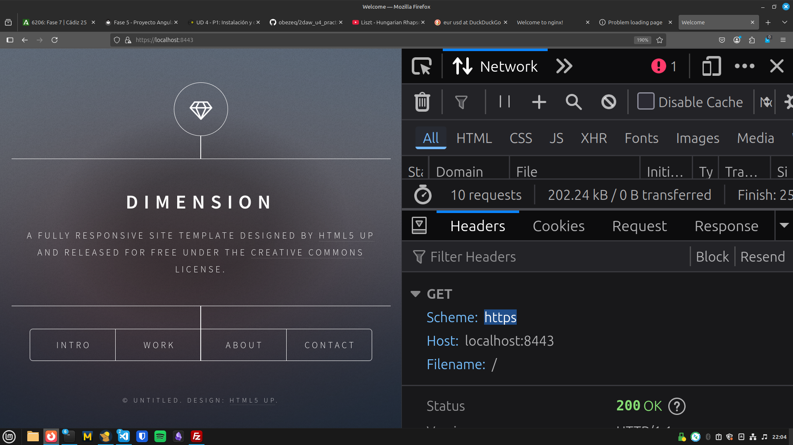

11) Redireccion forzada
- Que demuestra: HTTP redirige a HTTPS con codigo 301
- Evidencia: 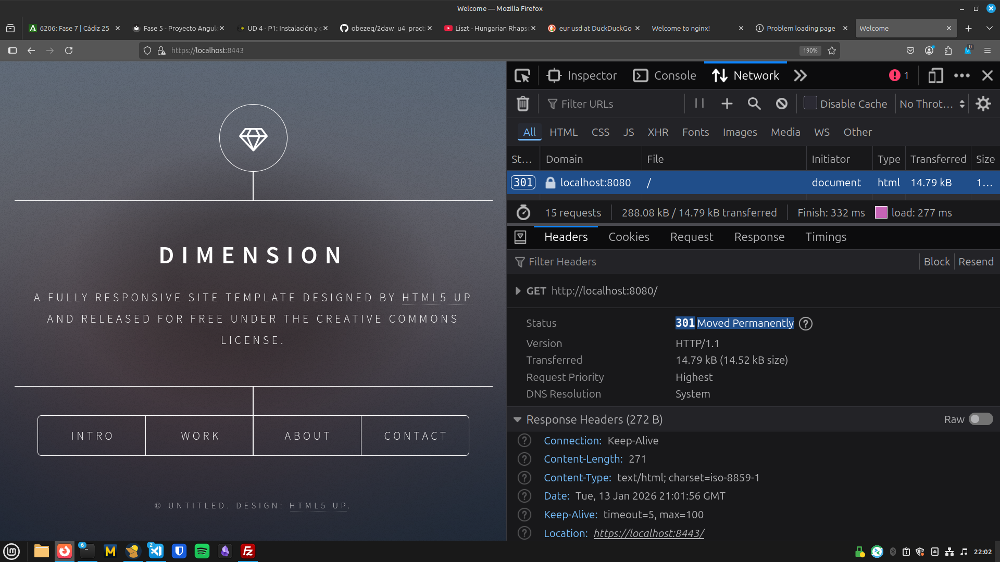

---

## Parte 2 — Evaluacion RA2 (a–j)

### a) Parametros de administracion

Para esta parte tuve que meterme dentro del contenedor y buscar las directivas principales en el archivo nginx.conf. Aqui explico cada una:

**worker_processes**
- Que controla: Es el numero de procesos que Nginx lanza para atender peticiones. Normalmente se pone `auto` para que use todos los nucleos del CPU.
- Ejemplo de config incorrecta: Si pongo `worker_processes 0;` el servidor directamente no arranca porque necesita al menos 1 worker.
- Como lo compruebo: Con `nginx -t` me salta error de configuracion invalida.

**worker_connections**
- Que controla: Cuantas conexiones simultaneas puede manejar cada worker. Si tengo 2 workers y 1024 conexiones, en total aguanto 2048 conexiones.
- Ejemplo de config incorrecta: Si pongo `worker_connections 1;` el servidor solo podria atender 1 conexion por worker, cualquier otra peticion se quedaria en cola o seria rechazada.
- Como lo compruebo: Haciendo muchas peticiones con curl en paralelo veria errores de conexion rechazada.

**access_log y error_log**
- Que controlan: Donde se guardan los logs de acceso y de errores. Por defecto estan en `/var/log/nginx/`.
- Ejemplo de config incorrecta: Si pongo `access_log /ruta/que/no/existe/access.log;` Nginx falla al iniciar porque no puede escribir el archivo.
- Como lo compruebo: Con `nginx -t` me dice que no puede abrir el fichero de log.

**keepalive_timeout**
- Que controla: Cuanto tiempo mantiene abierta una conexion TCP esperando mas peticiones del cliente. Ahorra recursos si el cliente hace varias peticiones seguidas.
- Ejemplo de config incorrecta: Si pongo `keepalive_timeout 0;` se cierra la conexion despues de cada peticion, lo que aumenta la latencia porque hay que abrir conexion nueva cada vez.
- Como lo compruebo: En las DevTools del navegador veria que cada recurso abre una conexion nueva en vez de reutilizar.
- **Cambio aplicado**: Modifique el valor de 65 a 30 segundos en mi configuracion para que las conexiones no se queden abiertas tanto tiempo en mi entorno de laboratorio.

**include**
- Que controla: Permite cargar archivos de configuracion externos. Asi puedo tener la config dividida en varios ficheros mas manejables.
- Ejemplo de config incorrecta: Si pongo `include /etc/nginx/conf.d/*.conf;` pero esa carpeta no existe o esta vacia, no pasa nada grave, pero si pongo un archivo que tiene errores de sintaxis, Nginx no arranca.
- Como lo compruebo: Con `nginx -t` me indica si algun archivo incluido tiene errores.

**gzip**
- Que controla: Activa la compresion de respuestas para que pesen menos y se transfieran mas rapido.
- Ejemplo de config incorrecta: Si pongo `gzip on;` pero no especifico `gzip_types`, solo comprime text/html por defecto, asi que mis CSS y JS no se comprimirian.
- Como lo compruebo: Con `curl -I -H "Accept-Encoding: gzip" http://localhost:8080/` y miro si aparece `Content-Encoding: gzip` en la respuesta.

Para verificar que todo estaba bien despues de revisar la config, ejecute `nginx -t` y luego `nginx -s reload` para aplicar los cambios.

- Evidencias:
  - 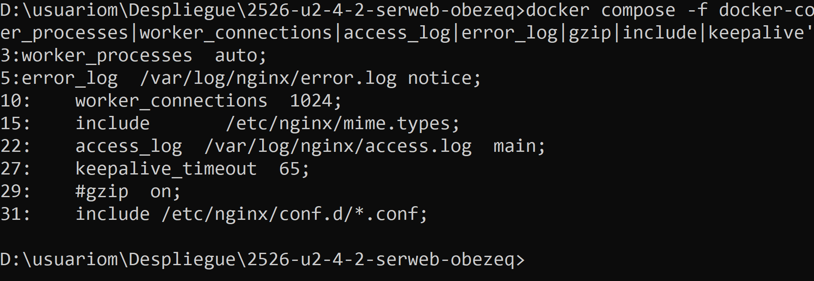
  - 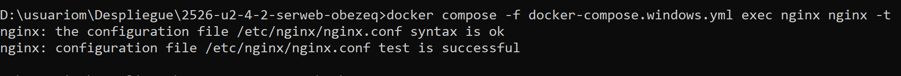
  - 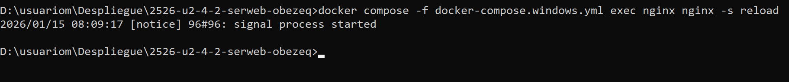

### b) Ampliacion de funcionalidad + modulo investigado
- Opcion elegida: **B2 (Cabeceras de seguridad)**
- Respuesta: Se han configurado las siguientes cabeceras de seguridad en el server block HTTPS:
  - `X-Content-Type-Options: nosniff` - Previene que el navegador interprete archivos con MIME type diferente al declarado (MIME sniffing)
  - `X-Frame-Options: DENY` - Previene ataques de clickjacking impidiendo que la pagina se cargue en un iframe
  - `Content-Security-Policy: default-src 'self'` - Restringe los recursos que puede cargar la pagina solo al mismo origen, previniendo ataques XSS

  Configuracion aplicada en default-https.conf:
  ```nginx
  add_header X-Content-Type-Options "nosniff" always;
  add_header X-Frame-Options "DENY" always;
  add_header Content-Security-Policy "default-src 'self'" always;
  ```

- Evidencias:
  - 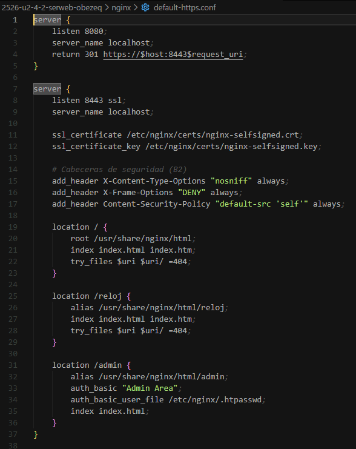
  - 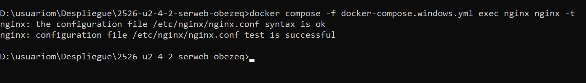
  - 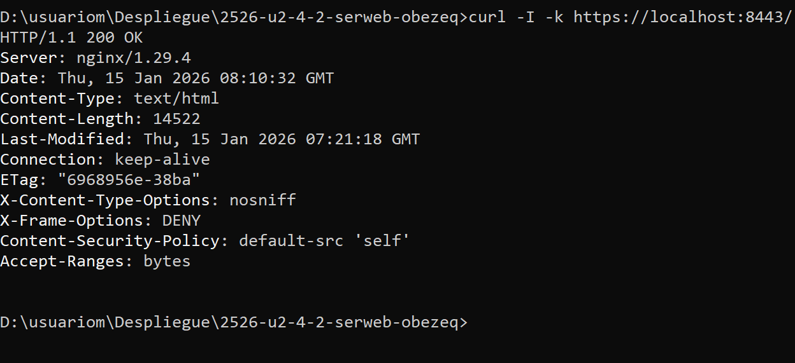

#### Modulo investigado: ngx_http_limit_req_module

- **Para que sirve:** Limita la tasa de peticiones por cliente para prevenir ataques de denegacion de servicio (DoS) y abuso de recursos. Permite definir zonas de memoria compartida que rastrean las peticiones por direccion IP, limitando cuantas peticiones puede hacer cada cliente por segundo.

- **Como se instala/carga:** Este modulo viene compilado por defecto en Nginx (no requiere instalacion adicional). Se activa mediante las directivas:
  ```nginx
  # En el bloque http (define la zona de memoria)
  limit_req_zone $binary_remote_addr zone=limitzone:10m rate=10r/s;

  # En el bloque location (aplica el limite)
  limit_req zone=limitzone burst=20 nodelay;
  ```
  - `zone=limitzone:10m`: Crea zona de 10MB llamada "limitzone"
  - `rate=10r/s`: Maximo 10 peticiones por segundo por IP
  - `burst=20`: Permite rafagas de hasta 20 peticiones
  - `nodelay`: Procesa las peticiones del burst inmediatamente

- **Fuente(s):**
  - Documentacion oficial: https://nginx.org/en/docs/http/ngx_http_limit_req_module.html

### c) Sitios virtuales / multi-sitio
- Respuesta: Se ha configurado multi-sitio por path:
  - Web principal en `/` con root en `/usr/share/nginx/html`
  - Web secundaria en `/reloj` usando alias a `/usr/share/nginx/html/reloj`

  La diferencia entre multi-sitio por path y por nombre es:
  - Por path: Un solo server_name, diferentes rutas (/, /reloj, /admin)
  - Por nombre: Diferentes server_name que apuntan a diferentes roots

  Otros tipos de multi-sitio: por puerto (listen 8080 vs 8443), por IP, por subdominios.
- Evidencias:
  - 
  - 
  - 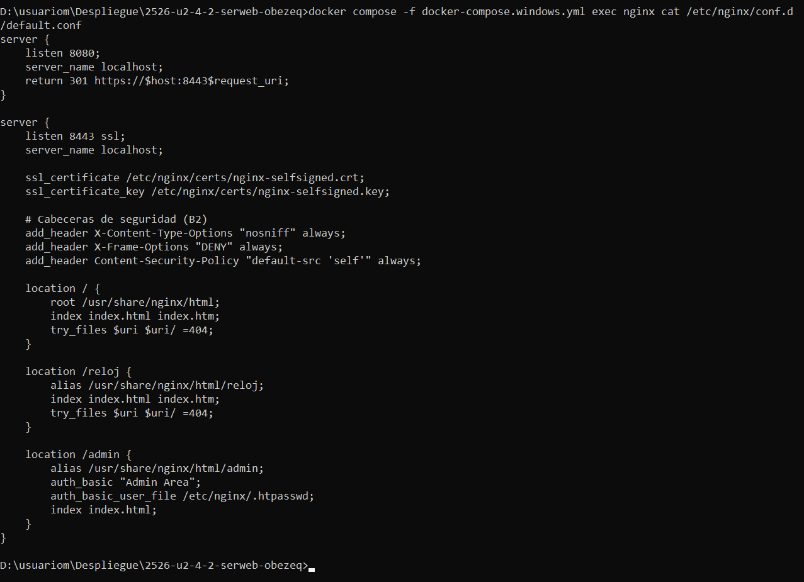

### d) Autenticacion y control de acceso
- Respuesta: Se ha protegido la ruta `/admin` con autenticacion HTTP Basic:
  - Se creo el directorio `web/html/admin/` con un `index.html` simple
  - Se genero el archivo `.htpasswd` con usuario `admin` usando el comando `htpasswd`
  - Se configuro `auth_basic "Admin Area"` en el location `/admin` de Nginx
  - El archivo `.htpasswd` se monta como volumen de solo lectura en el contenedor

  Configuracion en default-https.conf:
  ```nginx
  location /admin {
      alias /usr/share/nginx/html/admin;
      auth_basic "Admin Area";
      auth_basic_user_file /etc/nginx/.htpasswd;
      index index.html;
  }
  ```

  Comportamiento:
  - Sin credenciales: el servidor devuelve **401 Unauthorized**
  - Con credenciales correctas (`admin`): devuelve **200 OK** y muestra el contenido

- Evidencias:
  - 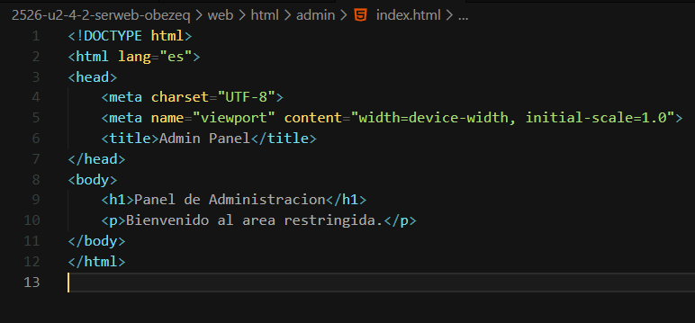
  - 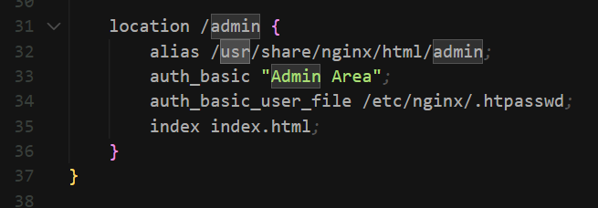
  - 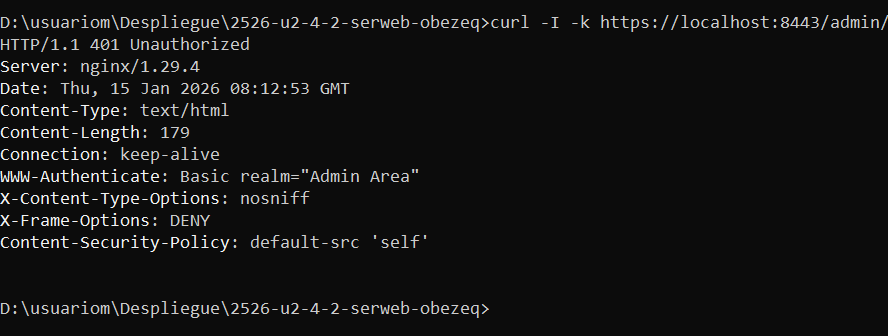
  - 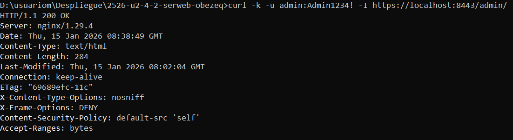

### e) Certificados digitales
- Respuesta: Se han generado certificados autofirmados:
  - `.crt`: Certificado publico que contiene la clave publica
  - `.key`: Clave privada del certificado
  - `-nodes`: No cifra la clave privada con contrasena (para laboratorio, evita pedir password al reiniciar Nginx)

  Comando usado:
  ```bash
  openssl req -x509 -nodes -days 365 -newkey rsa:2048 \
    -keyout nginx-selfsigned.key \
    -out nginx-selfsigned.crt \
    -subj "/C=ES/ST=Andalucia/L=Sevilla/O=IES/OU=DAW/CN=localhost"
  ```
- Evidencias:
  - 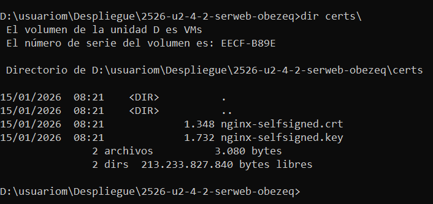
  - 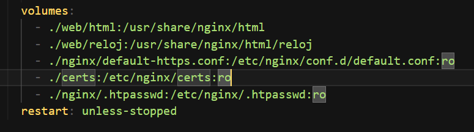
  - 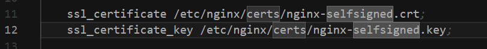

### f) Comunicaciones seguras
- Respuesta: Se usan dos bloques server:
  - Puerto 8080: Redirige todas las peticiones a HTTPS con codigo 301
  - Puerto 8443: Sirve el contenido con SSL habilitado

  Esto garantiza que toda comunicacion sea cifrada.
- Evidencias:
  - 
  - 

### g) Documentacion

#### Arquitectura del proyecto

**Estructura de carpetas:**
```
.
├── README.md                    # Requisitos de la practica
├── DESPLIEGUE.md               # Este documento
├── docker-compose.windows.yml   # Configuracion Docker para Windows
├── certs/                       # Certificados SSL
│   ├── nginx-selfsigned.crt
│   └── nginx-selfsigned.key
├── nginx/                       # Configuracion Nginx
│   ├── default-https.conf       # Server blocks HTTP y HTTPS
│   └── .htpasswd               # Credenciales para /admin
├── web/                         # Contenido web
│   ├── html/                    # Web principal (Cloud Academy)
│   │   └── admin/              # Area protegida
│   └── reloj/                   # Web secundaria (reloj analogico)
└── evidencias/                  # Capturas de pantalla
```

**Servicios Docker:**
| Servicio | Imagen | Funcion |
|----------|--------|---------|
| nginx | nginx:latest | Servidor web con HTTPS |
| sftp | linuxserver/openssh-server | Transferencia de archivos |

**Puertos expuestos:**
| Puerto | Protocolo | Uso |
|--------|-----------|-----|
| 8080 | HTTP | Redirige a HTTPS (301) |
| 8443 | HTTPS | Sirve contenido web con SSL |
| 2222 | SFTP | Transferencia de archivos |

**Volumenes montados:**
| Host | Contenedor | Proposito |
|------|------------|-----------|
| ./web/html | /usr/share/nginx/html | Web principal |
| ./web/reloj | /usr/share/nginx/html/reloj | Web secundaria |
| ./nginx/default-https.conf | /etc/nginx/conf.d/default.conf | Configuracion Nginx |
| ./certs | /etc/nginx/certs | Certificados SSL |
| ./nginx/.htpasswd | /etc/nginx/.htpasswd | Autenticacion |

#### Configuracion Nginx

- **Ubicacion:** `/etc/nginx/conf.d/default.conf` (montado desde `./nginx/default-https.conf`)
- **Server blocks:**
  - Puerto 8080: Redireccion HTTP → HTTPS con codigo 301
  - Puerto 8443: Contenido con SSL + cabeceras de seguridad (B2)
- **Locations configurados:**
  - `/` → root `/usr/share/nginx/html` (web principal)
  - `/reloj` → alias `/usr/share/nginx/html/reloj` (web secundaria)
  - `/admin` → alias con auth_basic (area protegida)

#### Seguridad implementada

- Certificados SSL autofirmados (seccion e)
- Redireccion forzada HTTP → HTTPS (seccion f)
- Cabeceras de seguridad X-Content-Type-Options, X-Frame-Options, CSP (seccion b)
- Autenticacion HTTP Basic para /admin (seccion d)

- Evidencias: Este documento contiene todas las capturas enlazadas en las secciones correspondientes.

### h) Ajustes para implantacion de apps
- Respuesta: Para desplegar una segunda app en /reloj se usa la directiva `alias` en lugar de `root`:
  ```nginx
  location /reloj {
      alias /usr/share/nginx/html/reloj;
      index index.html index.htm;
      try_files $uri $uri/ =404;
  }
  ```
  Problema tipico de permisos SFTP: El usuario SFTP no tiene permisos de escritura. Solucion: Configurar PUID/PGID correctos en el contenedor y asegurar que los directorios tienen permisos 755.
- Evidencias:
  - 
  - 

### i) Virtualizacion en despliegue
- Respuesta: Diferencias entre instalacion nativa y contenedores:
  - Instalacion nativa: Nginx instalado directamente en el SO, configuracion persistente, mas dificil de replicar
  - Contenedor efimero: Imagen base inmutable, configuracion inyectada por volumenes, facil de replicar y destruir/recrear

  En Docker la configuracion se monta como volumen (`./nginx/default.conf:/etc/nginx/conf.d/default.conf:ro`) permitiendo infraestructura inmutable.
- Evidencias:
  - 

### j) Logs: monitorizacion y analisis
- Respuesta: Los logs de Nginx se encuentran en `/var/log/nginx/`:
  - `access.log`: Registro de peticiones
  - `error.log`: Registro de errores

  Comandos de monitorizacion:
  ```bash
  sudo tail /var/log/nginx/access.log
  sudo tail /var/log/nginx/error.log
  docker compose logs -f nginx
  ```
- Evidencias:
  - 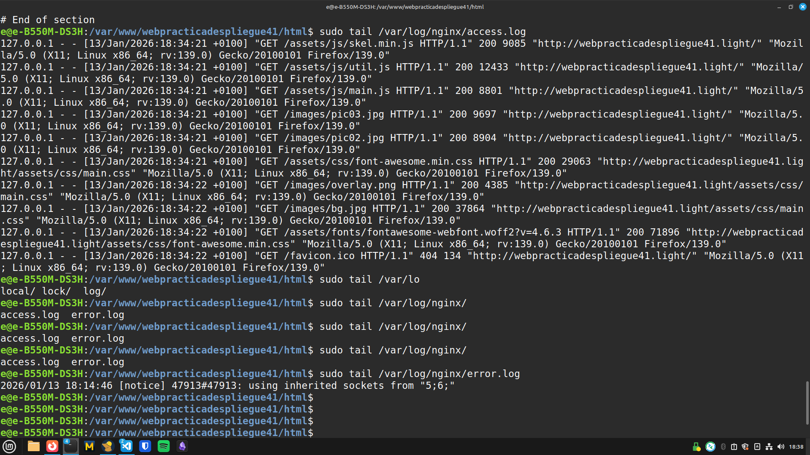
  - 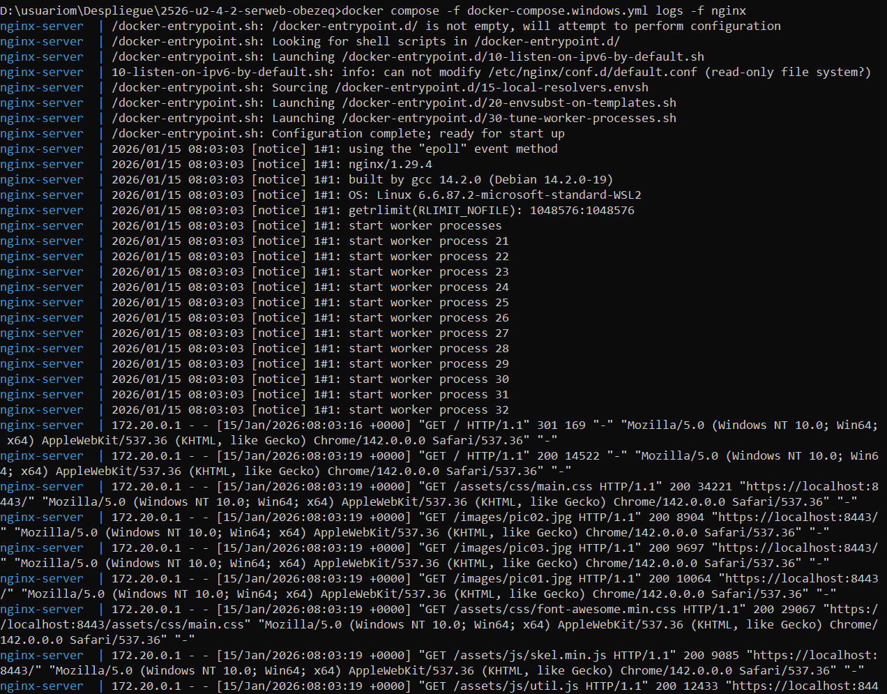
  - 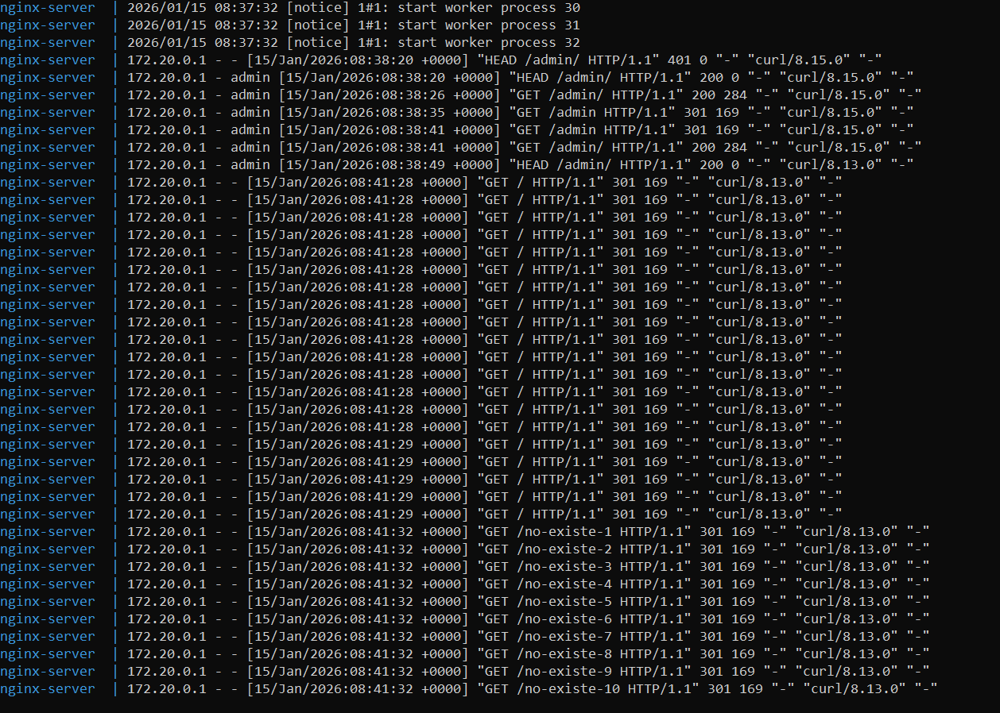

---

## Checklist final

### Parte 1
- [x] 1) Servicio Nginx activo
- [x] 2) Configuracion cargada
- [x] 3) Resolucion de nombres
- [x] 4) Contenido Web (Cloud Academy)
- [x] 5) Conexion SFTP exitosa
- [x] 6) Permisos de escritura
- [x] 7) Contenedores activos
- [x] 8) Persistencia (Volumen compartido)
- [x] 9) Despliegue multi-sitio (/reloj)
- [x] 10) Cifrado SSL
- [x] 11) Redireccion forzada (301)

### Parte 2 (RA2)
- [x] a) Parametros de administracion
- [x] b) Ampliacion de funcionalidad + modulo investigado
- [x] c) Sitios virtuales / multi-sitio
- [x] d) Autenticacion y control de acceso
- [x] e) Certificados digitales
- [x] f) Comunicaciones seguras
- [x] g) Documentacion
- [x] h) Ajustes para implantacion de apps
- [x] i) Virtualizacion en despliegue
- [x] j) Logs: monitorizacion y analisis
